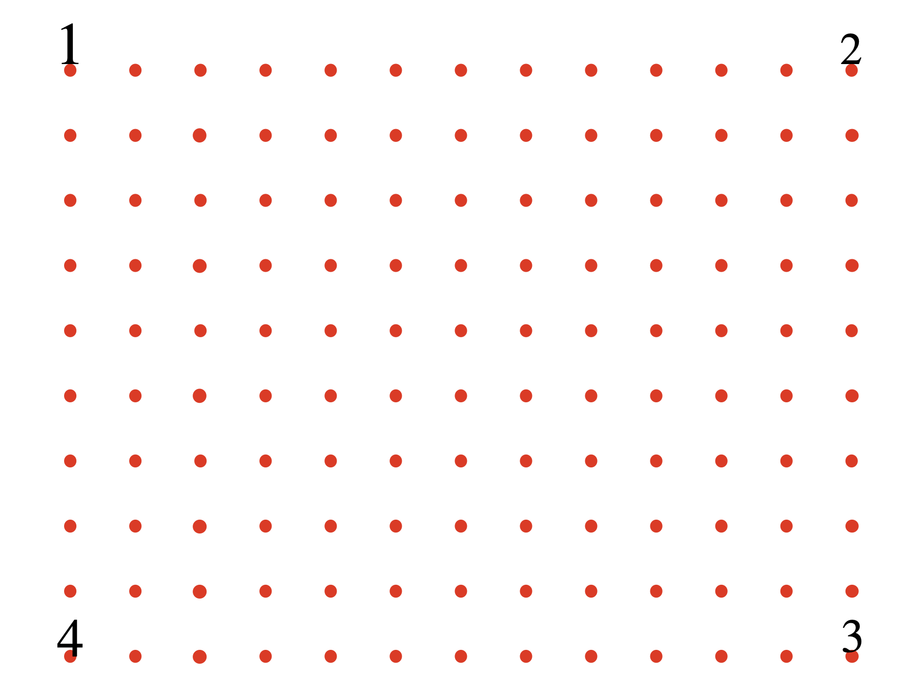
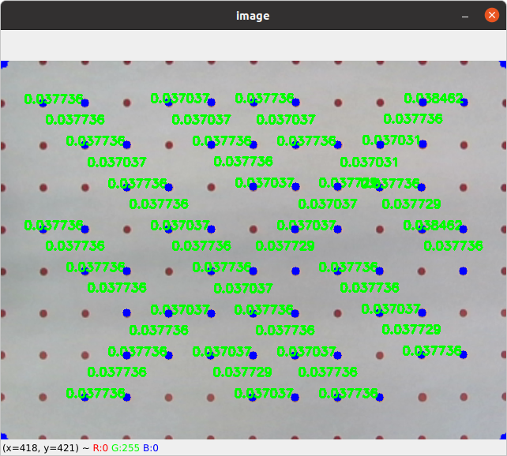

# camera_calibration

## Description
The function in this package is for checking the current camera parameters.  An ideal camera will have a constant ratio between the real distance and pixel distance. The fuction contained in this package could also telling the ratio under known environment.

## How to Use
- Add your picture path to the code and modify the scaling percentage for convinence.  
- Run the python program.
- Input the real distance in cmd/terminal used.
- Click on the 4 out most corner dots' center for perspective transformation calculation. 
__Dot Sequence Matters, please follow the steps below.__

- Click on 2 horizontal or vertical adjacent dots for ratio calculation.

## Items in Package
- ``dotField.pdf
``: A dot filed with 2 cm distance in horizontal and vertical for checking consistency.
- ``pixel2Real.py
``: Executable python file 

## Required python Libraries
- opencv-python
- numpy